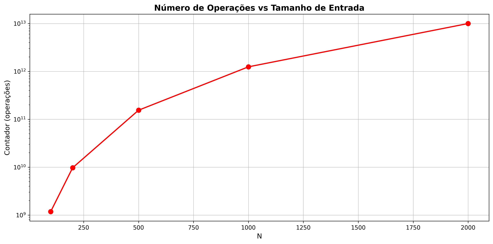
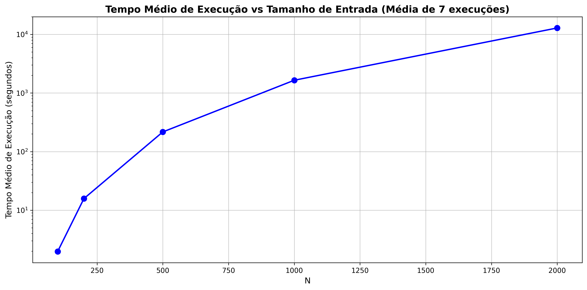

# Análise de Algoritmos - UFRR

**Disciplina:** Análise de Algoritmos  
**Instituição:** Universidade Federal de Roraima (UFRR)  
**Alunos:** Ryan Pimentel e Vicente Sampaio

## Descrição do Projeto

Este projeto apresenta uma análise experimental da complexidade de tempo de um algoritmo com múltiplos loops aninhados. O objetivo é demonstrar o comportamento assintótico do algoritmo através de medições empíricas de tempo de execução e contagem de operações.

## Estrutura do Projeto

```
├── main.c                     # Código principal do algoritmo em C
├── gerar_graficos.py          # Script para gerar gráficos de uma execução
├── gerar_graficos_media.py    # Script para calcular média de 7 execuções
├── csv/                       # Pasta contendo os arquivos CSV
│   ├── resultados1.csv
│   ├── resultados2.csv
│   ├── resultados3.csv
│   ├── resultados4.csv
│   ├── resultados5.csv
│   ├── resultados6.csv
│   ├── resultados7.csv
│   └── resultados_media_7execucoes.csv
└── imgs/                      # Pasta contendo os gráficos gerados
    ├── contador_7execucoes.png
    └── tempo_medio_7execucoes.png
```

## Algoritmo Analisado

O algoritmo implementado possui a seguinte estrutura de loops aninhados:

```c
for (l = 1; l <= 10000; l++) {
    for (i = 1; i <= n - 5; i++) {
        for (j = i + 2; j <= n/2; j++) {
            for (k = 1; k <= n; k++) {
                contador++;
            }
        }
    }
}
```

### Análise Teórica da Complexidade

- **Loop externo (l):** Executa 10.000 vezes (constante)
- **Loop i:** Executa aproximadamente `n - 5` vezes
- **Loop j:** Executa em média `(n/2 - i - 2)` vezes para cada i
- **Loop k:** Executa `n` vezes para cada combinação de i e j

**Complexidade teórica:** O(n³)

## Experimentos Realizados

### Tamanhos de Entrada Testados
- N = 1.000
- N = 10.000  
- N = 100.000
- N = 1.000.000

### Metodologia
1. **Execuções múltiplas:** Foram realizadas 7 execuções independentes para cada tamanho de entrada
2. **Medição de tempo:** Utilização da função `clock()` para medir o tempo de execução
3. **Contagem de operações:** Contador incrementado a cada iteração do loop mais interno
4. **Análise estatística:** Cálculo da média dos tempos de execução para maior precisão

## Resultados

### Gráfico 1: Número de Operações vs Tamanho de Entrada


Este gráfico mostra o crescimento do número de operações realizadas pelo algoritmo conforme o tamanho da entrada aumenta. A escala logarítmica evidencia o crescimento cúbico esperado.

### Gráfico 2: Tempo Médio de Execução vs Tamanho de Entrada


Este gráfico apresenta o tempo médio de execução calculado a partir de 7 execuções independentes, demonstrando a relação entre o tamanho da entrada e o tempo necessário para completar o algoritmo.

## Como Executar

### Pré-requisitos
- Compilador C (gcc)
- Python 3.x
- Bibliotecas Python: pandas, matplotlib

### Compilação e Execução do Programa C
```bash
gcc -o main main.c
./main
```

### Geração dos Gráficos
```bash
# Para gerar gráficos de uma única execução
python gerar_graficos.py

# Para gerar gráficos com média de 7 execuções
python gerar_graficos_media.py
```

## Observações

- **Valores constantes:** Os valores de N e contador são constantes entre execuções, apenas o tempo de execução varia devido a fatores do sistema
- **Precisão estatística:** A média de 7 execuções fornece maior confiabilidade nos resultados de tempo
- **Handler de sinal:** O programa inclui tratamento para interrupção (Ctrl+C) que exibe o valor atual do contador

## Conclusões

Os experimentos confirmam que o algoritmo possui complexidade de tempo O(n³), como evidenciado pelo crescimento cúbico tanto no número de operações quanto no tempo de execução. A análise empírica corrobora a análise teórica da complexidade assintótica do algoritmo.

---

*Projeto desenvolvido como parte da disciplina de Análise de Algoritmos da UFRR.*
